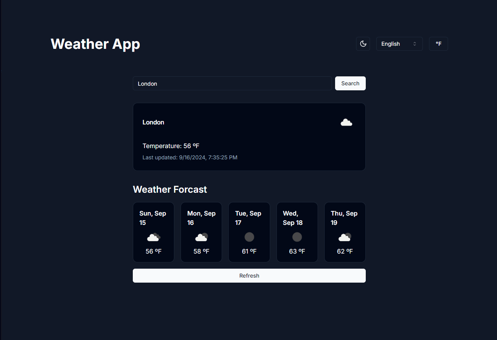
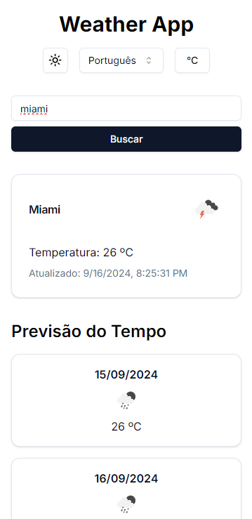

# Print Screens




# English

## Usage

- The app by default will try to fetch the weather and forecast from your current location.
- You can change the city by entering the city name in the search bar.

## Running the development server:

1. Clone the repository.

2. Intall the dependencies:

```bash
npm install
# or
pnpm install
# or
yarn install
```

3. Create a `.env.local` file in the root directory and add your OpenWeatherMap API key:

```bash
NEXT_PUBLIC_WEATHER_API_KEY=your_api_key_here
```

4. Run the development server:

```bash
npm run dev
# or
pnpm dev
# or
yarn dev
```

5. Open [http://localhost:3000](http://localhost:3000) with your browser.

# Português

## Uso

- Por padrão, o app tenta buscar informações da sua localização.
- É possível mudar a localidade escrevendo o nome da cidade na barra de pesquisa.

## Running the development server:

1. Clonar o repositório.

2. Instalar as dependências:

```bash
npm install
# or
pnpm install
# or
yarn install
```

3. Criar um arquivo `.env.local` na pasta raíz e adicionar a uma chave da OpenWeatherMap API:

```bash
NEXT_PUBLIC_WEATHER_API_KEY=your_api_key_here
```

4. Rodar o ambiente de desenvolvimento:

```bash
npm run dev
# or
pnpm dev
# or
yarn dev
```

5. Abrir [http://localhost:3000](http://localhost:3000) no seu navegador.
